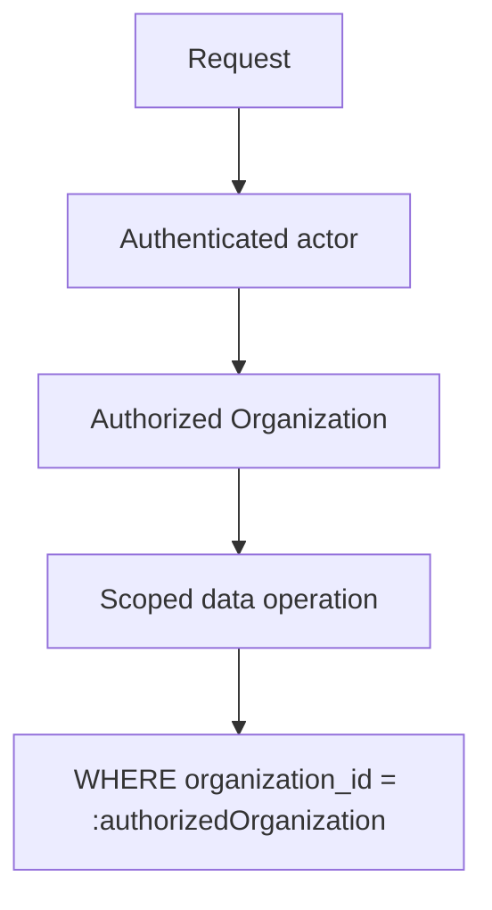

Rule & Form is a TypeScript application built on managed infrastructure.

Product-specific work lives in the domain model, Business Record, intake, rendering, publishing, provisioning, operational logic, Workbench, and provider interfaces. Generic infrastructure stays generic.

<Callout icon="terminal" color="#8B5CF6">
  **For implementation** — this page defines architectural constraints and current platform choices. It does not prescribe file structure, helper functions, or implementation patterns unless stated as a rule. Inspect the current repository and linked specifications before changing working conventions.
</Callout>

## The stack

| Layer | Choice | Role |
| --- | --- | --- |
| Application | Next.js · React · TypeScript | Portal, intake, Workbench, internal tools, APIs |
| Database | PostgreSQL | Canonical application data |
| Data access | Drizzle ORM | Schema, migrations, typed database access |
| Authentication | Better Auth | Identity, sessions, Organization membership |
| Validation | Zod | Runtime, configuration, and schema validation |
| Background work | Inngest | Durable workflows, retries, scheduled work |
| Hosting | Vercel | Application hosting and preview deployments |
| Source control | GitHub | Canonical repository and history |
| File storage | S3-compatible object storage | Photos, uploads, generated assets |
| Email | Resend | Transactional application email |
| Observability | Sentry · structured logs · workflow history | Errors, system activity, asynchronous execution |

PostgreSQL is the database contract. The database host can change without changing the domain model.

The storage vendor is deliberately absent from the architecture. The application depends on the storage contract, not a provider.

### What we own

Commodity infrastructure covers authentication, sessions, membership, storage, transactional email, deployment, error reporting, and UI primitives.

Rule & Form owns the systems that accumulate Rule & Form knowledge:

**Business Record · trade schemas · structured intake · content state · rendering rules · template mappings · publishing · provisioning · operational domain · Workbench · provider adapters · audit history**

That boundary matters more than the vendor underneath any individual layer.

<Accordion title="Why the vendor list is not the architecture">
  Hosting, database hosting, storage, authentication libraries, and workflow runners are infrastructure. They can change. Rule & Form's domain objects and operating rules remain stable across those changes.

  Naming the current provider documents what exists today. It does not grant permission to couple domain logic to that provider.

  We do not build our own database engine, authentication protocol, object-storage service, deployment platform, telecom carrier, or distributed workflow runtime. Engineering effort goes into the parts that accumulate product knowledge.
</Accordion>

---

## Repository

One canonical application repository. `main` is production.

<Tree>
  <Tree.Folder name="Application surfaces" />
  <Tree.Folder name="Domain" />
  <Tree.Folder name="Database" />
  <Tree.Folder name="Business Record" />
  <Tree.Folder name="Intake" />
  <Tree.Folder name="Content" />
  <Tree.Folder name="Publishing" />
  <Tree.Folder name="Provisioning" />
  <Tree.Folder name="Integrations" />
  <Tree.Folder name="Validation" />
  <Tree.Folder name="Shared UI" />
</Tree>

These are logical ownership boundaries, not mandatory folder names. Agents preserve the repository's working structure unless a change is required to enforce one of them.

Three rules hold regardless of structure:

- Business rules do not belong in page components.
- Provider-specific behavior does not leak across the application.
- Database access does not bypass the established data-access boundary for convenience.

### Branches and merges

Work happens on short-lived branches. A branch represents one coherent change, and every meaningful branch is deployed to a preview environment before production merge.

Git is the source of truth for application code, migrations, schemas, configuration, and implementation history. Production-only fixes do not exist outside the repository.

A change is not ready because it works in one browser session. Repository CI verifies the checks appropriate to the change, and a failing required check blocks merge.

**Type safety · linting · automated tests · production build · migration safety**

<Card title="Testing & Release Gates" icon="circle-check" horizontal href="/architecture/delivery/testing-fixtures-and-demo-reset">
  Exact commands, suites, and gate configuration.
</Card>

---

## Environments

<Tabs>
  <Tab title="Local">
    Non-production data and services.

    Safe to seed, reset, regenerate, corrupt, and delete test data.

    Does not connect to production customer systems by default.
  </Tab>
  <Tab title="Preview">
    Every meaningful branch can run as a deployed preview.

    Non-production data and provider connections.

    Cannot modify live customer records, publish over customer websites, send through customer messaging accounts, or operate against production provider resources.
  </Tab>
  <Tab title="Production">
    `main` deploys here.

    Real customer data and real provider connections.

    Only reviewed code from the canonical repository runs here.
  </Tab>
</Tabs>

A separate staging environment is added when operating reality gives us a reason to maintain one. <Badge color="orange" size="sm" stroke>Deferred</Badge>

### Public demo

The public demo runs the real application against a dedicated demo tenant containing synthetic data.

It may share production application code. It does not share customer identity, data, provider mappings, publishing targets, messaging resources, or writable external resources with a real customer.

Demo isolation uses the same tenant-boundary rules as the rest of the application, plus dedicated demo provider configuration wherever an external action is required.

<Warning>
  A public demo action must be incapable of affecting a customer account.
</Warning>

---

## Data safety

### Tenant isolation

Tenant isolation is explicit in application data access. Every operation on tenant-owned data carries the authorized Organization into the data-access layer, and the scope is applied at the database query itself.

This applies equally to customer requests, internal tools, webhooks, background jobs, provider commands, and reconciliation work.

Authentication answers **who is acting**. Tenant scope answers **which data that action can reach**.

<Warning>
  We do not retrieve global customer data and filter in the frontend. We do not rely on Row Level Security as the primary isolation mechanism.
</Warning>

<Accordion title="Why RLS is not the primary mechanism">
  Privileged server processes — background work, migrations, internal operations, integrations — operate outside user-scoped database policies. Tenant scope therefore remains mandatory in application data access.

  Database policies may add defense in depth. They do not replace explicit tenant scoping.
</Accordion>

<Card title="Accounts, Tenancy & Identity" icon="shield" horizontal href="/architecture/foundation/accounts-tenancy-and-identity">
  Authorization policy and tenant resolution.
</Card>

### Database changes

Database structure changes through version-controlled migrations.

<Steps>
  <Step title="Change the schema">
    Alongside the application code that requires it.
  </Step>
  <Step title="Create the migration">
    Version-controlled, committed with the code.
  </Step>
  <Step title="Validate against non-production data">
    In local or preview, never against production.
  </Step>
  <Step title="Preview, then deploy">
    Repository history must contain enough information to reconstruct the schema.
  </Step>
</Steps>

Production tables are not changed through undocumented manual edits.

Application code and database state do not change atomically. Where a change would break an adjacent deployment, use an expand-contract sequence.

<Accordion title="Expand-contract sequence">
  1. Add compatible structure.
  2. Deploy code that supports both states.
  3. Move data or behavior across.
  4. Remove the obsolete structure in a later release.

  A destructive schema change is not coupled blindly to the first deploy that stops using the old structure.
</Accordion>

### Rollback

Application code can be returned to a known previous deployment. Database migrations do not roll back with it.

Production migrations are therefore forward-moving changes that must remain compatible with the deployment states that legitimately coexist during a release.

Rollback strategy is part of the migration, not something invented after the release fails.

### Backup and recovery

Production customer data requires automated database backup and point-in-time recovery, or an equivalent capability.

A backup is only useful if it can be restored. Recovery is tested periodically against non-production infrastructure.

Recovery configuration, retention, and restore procedures are operating requirements, not assumptions. Exact objectives belong in the data-recovery specification.

---

## Operations

### Secrets and configuration

| Rule | Applies to |
| --- | --- |
| Secrets never live in source code | All environments |
| Local secrets live in ignored environment configuration | Local |
| Hosted secrets are scoped to the environment that requires them | Preview · Production |
| Server-only credentials never reach the browser | All environments |
| Provider tokens never appear in logs | All environments |
| Production credentials are never copied into preview | Preview |

Required environment configuration is schema-validated when the application starts. Missing or invalid configuration fails visibly rather than allowing the application to start in an unknown state.

### Observability

Thrown exceptions are only one class of failure. Rule & Form must also expose the state of asynchronous and external work.

**Application errors · structured logs · workflow runs · provider commands · provider events · audit history**

A publishing run stuck in retry is visible. A failed provider command is visible. A webhook that arrived but failed processing is visible.

<Card title="Audit & Observability" icon="activity" horizontal href="/architecture/control/audit-and-observability">
  Event model, retention, alerting, and operating views.
</Card>

### Deployment

Application deployment follows Git — local change, feature branch, CI, preview, review, merge to `main`, production.

Long-running publishing and provisioning work executes independently of the browser request that initiated it. Closing a browser does not terminate a deployment, and a provider failure does not require replaying successful steps from the beginning.

---

## Working with the Build Spec

Cursor, Claude Code, Codex, MCP-connected tools, and other development interfaces operate against the same repository. They are not architectural dependencies, and no development tool gets its own source of truth.

<Callout icon="terminal" color="#8B5CF6">
  **For implementation** — before changing an existing subsystem, inspect the current repository, the relevant Build Spec pages, existing tests and migrations, and the current provider boundary where applicable.

  The Build Spec defines intent and invariants. The repository defines the implementation that exists now. When the two conflict, surface and resolve the conflict deliberately rather than silently rewriting one to match the other.
</Callout>

---

## Foundation rules

1. **One repository is the source of truth for application behavior.**
2. **`main` is production.**
3. **Every meaningful change is previewable before merge.**
4. **Required CI checks block unsafe merges.**
5. **Non-production cannot affect production customer systems.**
6. **Every tenant-owned data operation carries explicit Organization scope.**
7. **Database migrations are versioned and deployment-compatible.**
8. **Code rollback never assumes database rollback.**
9. **Production data has a tested recovery path.**
10. **Required configuration is validated before the application operates.**
11. **Observability includes asynchronous work, not only application exceptions.**
12. **Provider-specific code stays behind integration boundaries.**
13. **Development tools may change without changing the source of truth.**
14. **The Build Spec defines constraints and intent. It does not replace inspection of the working system.**

**The repository is the application. The Build Spec defines the constraints it must preserve.**

---

## Proof

<Columns cols={2}>
  <Card title="Production application" icon="external-link" href="https://app.ruleandform.com">
    The live system this page describes.
  </Card>

  <Card title="Isolated demo" icon="flask-conical" href="https://demo.ruleandform.com">
    Real application, synthetic tenant, no customer reach.
  </Card>
</Columns>

## Next

<Columns cols={2}>
  <Card title="Domain Model & Database Schema" icon="database" href="/architecture/foundation/domain-model-and-database-schema">
    How the schema enforces what this page requires.
  </Card>

  <Card title="Accounts, Tenancy & Identity" icon="shield" href="/architecture/foundation/accounts-tenancy-and-identity">
    Who is allowed to reach which tenant.
  </Card>
</Columns>