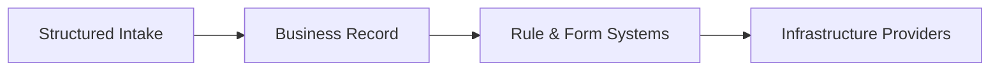
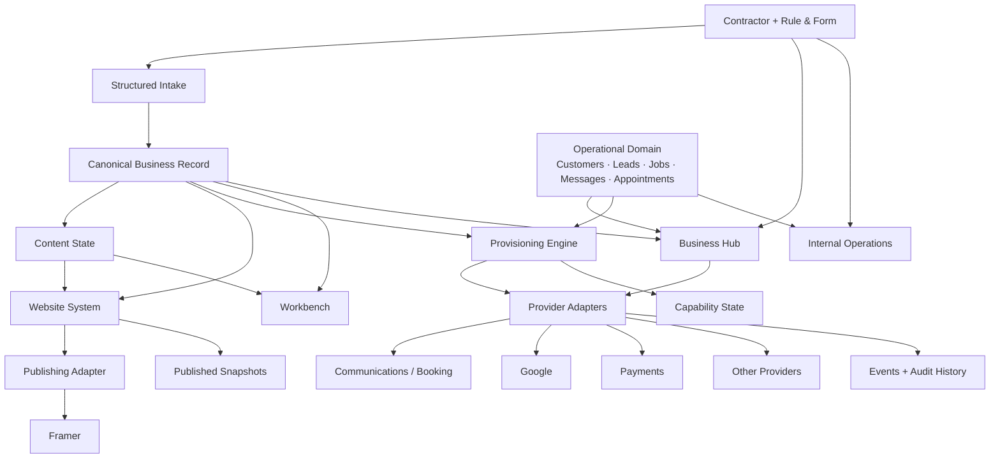

# System Map

Rule & Form owns the business model, canonical data, operating logic, and customer experience.

External platforms provide execution infrastructure behind controlled interfaces.



One business is represented once. Every system that serves it works from that representation.

## System topology



## Canonical Business Record

The **Business Record** is the source of truth for facts about the business.

It contains identity, services, service areas, credentials, contact information, offers, financing, languages, photos, preferences, and other structured business attributes.

The contractor supplies those facts once. Every Rule & Form system that needs them reads from the same record.

The Business Record is versioned and schema-versioned.

It does not contain leads, messages, appointments, provider credentials, provisioning state, or audit history. Those remain separate system objects with separate ownership.

**Proof:** \[Inspect a live Business Record →\]

## Content State

Business facts and published content are not the same thing.

**Content State** holds generated content, approved content, manual edits, locks, and explicit overrides.

A regeneration can change what should change without overwriting an approved human decision.

The Business Record says what is true about the business.

Content State says what Rule & Form has approved to say about it.

**Proof:** \[Run the regeneration demo →\]

## Published Snapshots

Every publish creates an immutable **Published Snapshot** of the state that produced the live output.

A snapshot records the relevant:

- Business Record version
- Content State version
- Template version
- Mapping version
- Published output references
- Publication result

A live site can always be traced to the exact inputs and rules that produced it.

**Proof:** \[Inspect a published snapshot →\]

## Core systems

### Structured Intake

**Structured Intake** collects, validates, and normalizes business information.

Questions appear only when relevant. Structured input is the default. Controlled freeform input handles exceptions.

**Proof:** \[Open live intake →\]

### Website System

The **Website System** turns approved business data into pages, sections, metadata, structured data, localization, and CMS records.

Rendering rules determine what appears, what disappears, and which approved variant is used.

**Proof:** \[Inspect a live website build →\]

### Business Hub

The **Business Hub** is the contractor-facing operating surface.

It exposes the narrow set of things the contractor needs to act on: website, leads, inbox, schedule, follow-up, analytics, and setup.

**Proof:** \[Open demo Business Hub →\]

### Provisioning Engine

The **Provisioning Engine** determines the state of each capability from the underlying configuration and connection state.

It answers three questions for every capability:

**Is it working? Who has the ball? What happens next?**

**Proof:** \[Inspect live capability state →\]

### Workbench

The **Workbench** exposes how the system reached a result.

It shows source fields, content state, mappings, rendering decisions, published values, overrides, and divergence without requiring direct access to provider systems.

It is also the primary proof surface for the system.

**Proof:** \[Open Workbench →\]

### Internal Operations

**Internal Operations** exposes the same underlying state from the Rule & Form side: blockers, failures, overdue actions, integration health, changes, and exceptions.

It is an operating surface, not a second source of truth.

**Proof:** \[Open internal system state →\]

## Operational domain

Business facts and business activity are separate domains.

The operational domain owns customers, leads, jobs, conversations, calls, appointments, notifications, change requests, provider mappings, and system events.

Rule & Form keeps its own identifiers and domain model.

Provider IDs are mappings.

A lead is a Rule & Form lead even when HighLevel transports the message.

A website is a Rule & Form website even when Framer renders it.

## Write ownership

Every field has one authoritative write path.

Business facts are changed through Rule & Form.

Content State changes only through explicit generation, approval, editing, locking, or override actions.

Provider-owned events can update the Rule & Form operational objects mapped to those providers. They do not write canonical business facts.

V1 does not allow competing writers for the same field.

**One field. One authority.**

## Progressive provisioning

Capabilities are provisioned independently.

A customer does not have one giant onboarding state.

Each capability resolves to one of six states:

- **Live**: working now
- **Ready**: configured and available
- **Action needed**: waiting on the customer
- **In progress**: Rule & Form is handling it
- **Connect when ready**: optional and not blocking
- **Not enabled**: intentionally unused

Status is derived from underlying state. Staff do not manually maintain labels.

Incomplete setup can reduce functionality. It must not break the customer-facing website or silently lose an inquiry.

**Proof:** \[Change a capability and watch its state resolve →\]

## Provider boundary

Framer, HighLevel, Google, Stripe, and future providers are infrastructure.

Rule & Form communicates with them through named interfaces.

```text
WebsitePublisher
    Framer today
    another publisher later

MessagingProvider
    HighLevel today
    Twilio / Telnyx later

CalendarProvider
    HighLevel today
    Nylas later

AutomationProvider
    HighLevel workflows today
    Inngest where Rule & Form owns execution
```

Product logic uses Rule & Form concepts, not provider terminology or provider data models.

Replacing a provider can require engineering work. It must not require redefining the customer, the Business Record, or the Rule & Form product.

**Proof:** \[Inspect provider mappings and commands →\]

## Failure semantics

External failure does not erase completed work.

Long-running provisioning and publishing run as durable steps. Each step records its result and resumes from the failed point when safe.

Every external command carries a stable idempotency key. Retrying a command must not create duplicate customers, messages, CMS records, appointments, or other side effects.

Provider events are recorded before processing so the original event survives processing failure.

When a capability cannot operate safely, Rule & Form exposes the failure or falls back to a known working state. It does not silently enter an unknown one.

**Proof:** \[Run the failed-publish and retry demo →\]

## Proof surfaces

The architecture is meant to be inspected, changed, and broken safely.

### Regeneration

Change source data and regenerate.

Generated content updates.

Approved manual edits survive.

\[Run regeneration demo →\]

### Failure recovery

Force a publishing step to fail.

The run records the failed step, preserves completed work, retries safely, and resumes.

\[Run failure demo →\]

### Deployment ledger

Every instrumented deployment records the actual human and system work required to launch it.

The ledger tracks task, duration, reusable work, manual work, failures, and support burden.

\[Open deployment ledger →\]

## Demo isolation

Public proof runs against an unmistakably labeled demo tenant.

Demo actions cannot read from, write to, publish over, message through, or otherwise affect a production customer account.

The demo proves the system without exposing customer data.

## Foundation rules

1. **Business facts have one canonical source.**
2. **Every field has one authoritative writer.**
3. **Every customer-owned object is tenant-scoped at the data boundary.**
4. **Business data, approved content, and operational activity remain separate domains.**
5. **Published output is versioned and traceable to every state that produced it.**
6. **Capability status is derived from reality, not manually maintained.**
7. **Provider-specific logic stays behind named adapters.**
8. **Long-running work is durable, retryable, and idempotent.**
9. **External events are recorded before they are processed.**
10. **Manual exceptions, overrides, and failures are visible and auditable.**
11. **The customer interface exposes Rule & Form concepts, not vendor concepts.**
12. **A provider can change without changing what Rule & Form is.**

The architecture has one job: **one business, represented once, driving every system that serves it.**